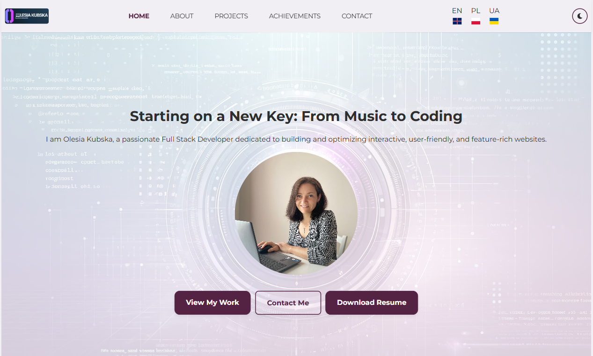

# 🖥️ Olesia Kubska – Developer Portfolio

Welcome to my personal developer portfolio!  
Built with React + Vite, it showcases my featured projects, skills, and a little bit about me as a Full Stack Developer.

---



---

### 🔗 Live Demo
[](https://olesiakubska.github.io/olesia-kubska-portfolio/)

---

### 🧰 Tech Stack & Tools


---

### ✨ Features

- Responsive and mobile-friendly layout  
- Smooth animations and scroll  
- Project cards with previews  
- Swiper carousel for project section  
- Contact section with working form
- Multi-language support (Ukrainian 🇺🇦, English 🇬🇧, Polish 🇵🇱) via i18next

---

### 🧩 About the Project

This portfolio is a single-page application that highlights my work, technologies I use, and my development journey.  
My goal was to make it visually clear, minimalistic, and easy to explore for potential employers, collaborators, or anyone curious about what I build.

---

### 🚀 Getting Started

To run the project locally:

```bash
git clone https://github.com/OlesiaKubska/olesia-kubska-portfolio.git
cd olesia-kubska-portfolio
npm install
npm run dev
```
---

### 📬 Contacts & Profiles

- 🌐 GitHub → [](https://github.com/OlesiaKubska)

- 📬 Telegram → [](https://t.me/olesiakubska)

- 💼 LinkedIn → [](https://linkedin.com/in/olesia-kubska)

---

### 📄 License
This project is open source and available under the MIT License.

### ✍️ Author
Olesia Kubska

---
